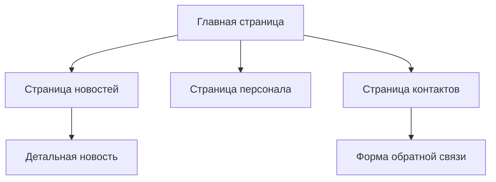

## 1. Обзор продукта
Сайт школы для узбекского образовательного учреждения. Предоставляет информацию о школе, достижениях, персонале и новостях.
Целевая аудитория: родители, ученики, учителя и потенциальные абитуриенты.

## 2. Основные функции

### 2.1 Пользовательские роли
| Роль | Способ регистрации | Основные разрешения |
|------|-------------------|---------------------|
| Гость | Не требуется | Просмотр всех страниц |
| Администратор | Панель управления | Редактирование контента |

### 2.2 Модуль функций
Сайт школы состоит из следующих основных страниц:
1. **Главная страница**: герой-секция со слоганом, статистика школы, последние новости.
2. **Страница новостей**: список всех новостей и событий школы.
3. **Страница персонала**: список учителей и сотрудников с фотографиями.
4. **Контакты**: контактная информация, карта проезда, форма обратной связи.

### 2.3 Детали страниц
| Название страницы | Название модуля | Описание функции |
|------------------|-----------------|------------------|
| Главная страница | Герой-секция | Отображает слоган школы, фоновое изображение, краткое приветствие |
| Главная страница | Статистика | Показывает количество учеников, учителей, достижений в цифрах |
| Главная страница | Последние новости | Карточки с последними 3-5 новостями школы |
| Страница новостей | Список новостей | Отображает все новости с пагинацией, датой публикации |
| Страница новостей | Детальная новость | Полный текст выбранной новости с изображениями |
| Страница персонала | Список учителей | Карточки учителей с фото, ФИО, предметом преподавания |
| Контакты | Контактная информация | Адрес, телефон, email, часы работы школы |
| Контакты | Форма обратной связи | Поля для имени, email, темы и текста сообщения |

## 3. Основные процессы
Пользователь заходит на сайт → видит герой-секцию с информацией о школе → просматривает статистику → читает последние новости → при необходимости переходит на полный список новостей → просматривает информацию о учителях → находит контактную информацию для связи.

## 4. Пользовательский интерфейс

### 4.1 Стиль дизайна
- Основные цвета: синий (#1e40af), белый (#ffffff), серый (#6b7280)
- Стиль кнопок: современные с закругленными углами
- Шрифт: системные шрифты, основной размер 16px
- Стиль макета: карточки с тенями, навигация вверху
- Иконки: современные линейные иконки

### 4.2 Обзор дизайна страниц
| Название страницы | Название модуля | Элементы интерфейса |
|------------------|-----------------|---------------------|
| Главная страница | Герой-секция | Полноэкранный баннер с фото школы, слоган поверх, призыв к действию |
| Главная страница | Статистика | 3-4 карточки с круглыми иконками и крупными цифрами |
| Главная страница | Новости | Горизонтальная прокрутка карточек новостей с превью |
| Страница новостей | Список | Вертикальный список карточек, фильтр по дате, пагинация |
| Страница персонала | Сетка учителей | Адаптивная сетка карточек с фото круглой формы |
| Контакты | Информация | Карта с маркером, контактные данные в карточках |

### 4.3 Адаптивность
Десктоп-ориентированный дизайн с адаптацией под мобильные устройства. Оптимизация касательного взаимодействия для смартфонов и планшетов.