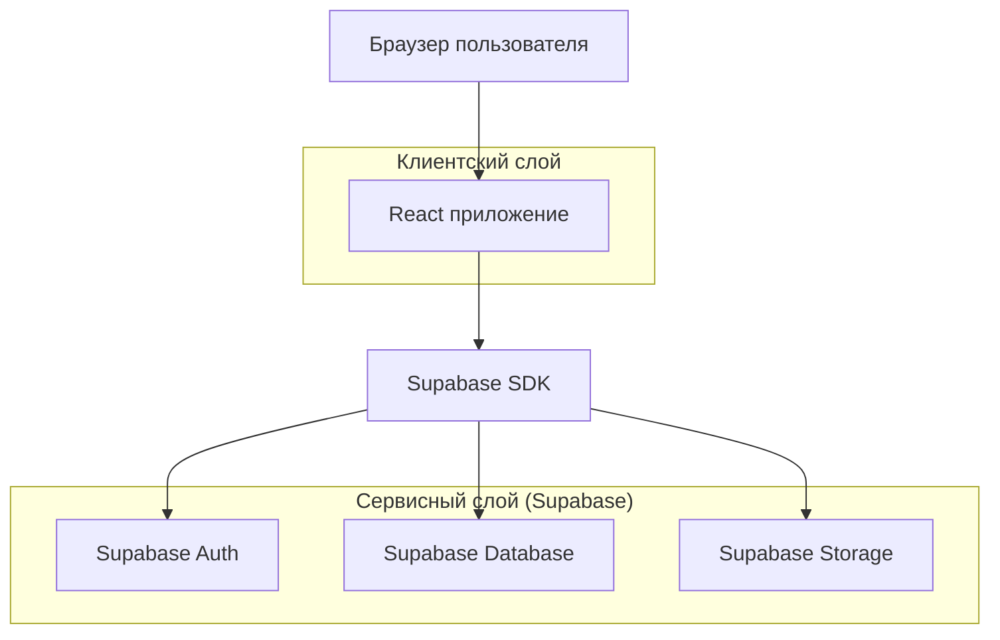
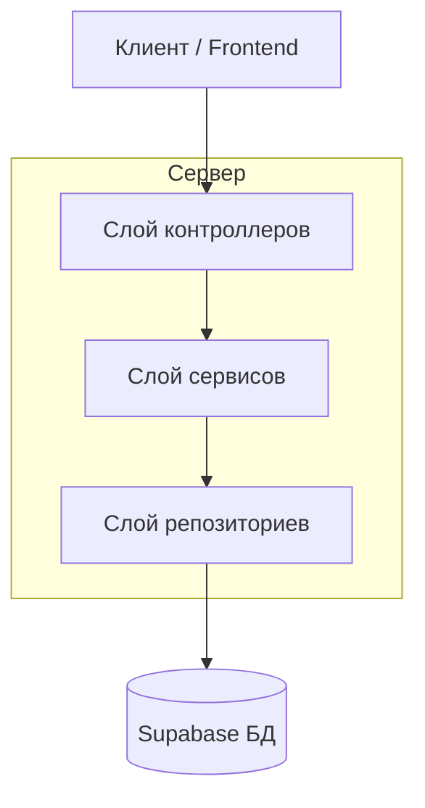
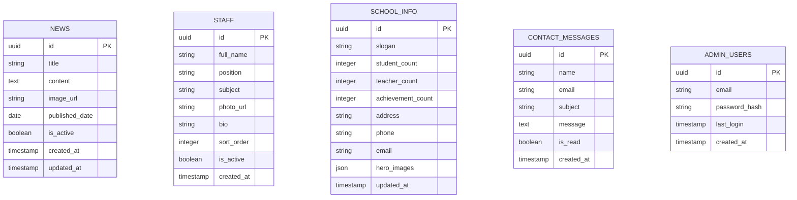

## 1. Архитектура проекта



## 2. Описание технологий

- Frontend: React@18 + tailwindcss@3 + vite
- Инициализация: vite-init
- Backend: Supabase (BaaS)
- База данных: PostgreSQL (встроена в Supabase)
- Аутентификация: Supabase Auth
- Хранилище файлов: Supabase Storage

## 3. Определение маршрутов

| Маршрут | Назначение |
|---------|------------|
| / | Главная страница с герой-секцией, статистикой и новостями |
| /news | Страница со списком всех новостей |
| /news/:id | Детальная страница конкретной новости |
| /staff | Страница со списком учителей и сотрудников |
| /contacts | Страница с контактной информацией и формой обратной связи |
| /admin | Панель администратора для управления контентом |
| /login | Страница входа для администратора |

## 4. Определение API

### 4.1 Основные API endpoints

Получение списка новостей
```
GET /api/news
```

Request параметры:
| Параметр | Тип | Обязательный | Описание |
|-----------|-----|--------------|----------|
| limit | number | false | Количество новостей (по умолчанию 10) |
| offset | number | false | Смещение для пагинации |

Response:
| Параметр | Тип | Описание |
|-----------|-----|----------|
| news | array | Массив объектов новостей |
| total | number | Общее количество новостей |

Получение информации о школе
```
GET /api/school-info
```

Response:
| Параметр | Тип | Описание |
|-----------|-----|----------|
| statistics | object | Объект с статистикой (ученики, учителя, достижения) |
| hero | object | Информация для герой-секции |

Получение списка сотрудников
```
GET /api/staff
```

Response:
| Параметр | Тип | Описание |
|-----------|-----|----------|
| staff | array | Массив объектов сотрудников |

Отправка контактной формы
```
POST /api/contact
```

Request:
| Параметр | Тип | Обязательный | Описание |
|-----------|-----|--------------|----------|
| name | string | true | Имя отправителя |
| email | string | true | Email отправителя |
| subject | string | true | Тема сообщения |
| message | string | true | Текст сообщения |

## 5. Архитектура сервера



## 6. Модель данных

### 6.1 Определение модели данных



### 6.2 Определение данных (DDL)

Таблица новостей (news)
```sql
-- создание таблицы
CREATE TABLE news (
    id UUID PRIMARY KEY DEFAULT gen_random_uuid(),
    title VARCHAR(255) NOT NULL,
    content TEXT NOT NULL,
    image_url VARCHAR(500),
    published_date DATE DEFAULT CURRENT_DATE,
    is_active BOOLEAN DEFAULT true,
    created_at TIMESTAMP WITH TIME ZONE DEFAULT NOW(),
    updated_at TIMESTAMP WITH TIME ZONE DEFAULT NOW()
);

-- создание индексов
CREATE INDEX idx_news_published_date ON news(published_date DESC);
CREATE INDEX idx_news_active ON news(is_active);

-- начальные данные
INSERT INTO news (title, content, image_url, published_date) VALUES
('Начало нового учебного года', 'Уважаемые ученики и родители! Поздравляем вас с началом нового учебного года...', '/images/news1.jpg', '2024-09-01'),
('Школьные достижения', 'Наши ученики показали отличные результаты на районных олимпиадах...', '/images/news2.jpg', '2024-08-15');
```

Таблица сотрудников (staff)
```sql
-- создание таблицы
CREATE TABLE staff (
    id UUID PRIMARY KEY DEFAULT gen_random_uuid(),
    full_name VARCHAR(255) NOT NULL,
    position VARCHAR(255) NOT NULL,
    subject VARCHAR(255),
    photo_url VARCHAR(500),
    bio TEXT,
    sort_order INTEGER DEFAULT 0,
    is_active BOOLEAN DEFAULT true,
    created_at TIMESTAMP WITH TIME ZONE DEFAULT NOW()
);

-- создание индексов
CREATE INDEX idx_staff_active ON staff(is_active);
CREATE INDEX idx_staff_sort_order ON staff(sort_order);

-- начальные данные
INSERT INTO staff (full_name, position, subject, photo_url, bio) VALUES
('Алимов Абдуллах Абдумаликович', 'Директор школы', '', '/images/director.jpg', 'Опыт работы в сфере образования более 20 лет'),
('Исмоилова Зулхумор Умаровна', 'Учитель математики', 'Математика', '/images/math-teacher.jpg', 'Преподает математику с 2010 года');
```

Таблица информации о школе (school_info)
```sql
-- создание таблицы
CREATE TABLE school_info (
    id UUID PRIMARY KEY DEFAULT gen_random_uuid(),
    slogan VARCHAR(500) NOT NULL,
    student_count INTEGER DEFAULT 0,
    teacher_count INTEGER DEFAULT 0,
    achievement_count INTEGER DEFAULT 0,
    address VARCHAR(500),
    phone VARCHAR(50),
    email VARCHAR(255),
    hero_images JSONB,
    updated_at TIMESTAMP WITH TIME ZONE DEFAULT NOW()
);

-- начальные данные
INSERT INTO school_info (slogan, student_count, teacher_count, achievement_count, address, phone, email, hero_images) VALUES
('Образование - путь к будущему', 850, 65, 120, 'г. Ташкент, ул. Махтумкули, 45', '+998 90 123-45-67', 'info@buvaydaim.uz', '["/images/hero1.jpg", "/images/hero2.jpg"]');
```

Таблица контактных сообщений (contact_messages)
```sql
-- создание таблицы
CREATE TABLE contact_messages (
    id UUID PRIMARY KEY DEFAULT gen_random_uuid(),
    name VARCHAR(255) NOT NULL,
    email VARCHAR(255) NOT NULL,
    subject VARCHAR(255) NOT NULL,
    message TEXT NOT NULL,
    is_read BOOLEAN DEFAULT false,
    created_at TIMESTAMP WITH TIME ZONE DEFAULT NOW()
);

-- создание индексов
CREATE INDEX idx_contact_messages_created_at ON contact_messages(created_at DESC);
CREATE INDEX idx_contact_messages_is_read ON contact_messages(is_read);
```

### 6.3 Права доступа Supabase

-- Права для anon роли (публичный доступ)
```sql
GRANT SELECT ON news TO anon;
GRANT SELECT ON staff TO anon;
GRANT SELECT ON school_info TO anon;
GRANT INSERT ON contact_messages TO anon;
```

-- Права для authenticated роли (администратор)
```sql
GRANT ALL PRIVILEGES ON news TO authenticated;
GRANT ALL PRIVILEGES ON staff TO authenticated;
GRANT ALL PRIVILEGES ON school_info TO authenticated;
GRANT ALL PRIVILEGES ON contact_messages TO authenticated;
```

### 6.4 Политики безопасности Supabase

```sql
-- Политика для чтения активных новостей
CREATE POLICY "Публичный доступ к активным новостям" ON news
    FOR SELECT USING (is_active = true);

-- Политика для чтения активных сотрудников
CREATE POLICY "Публичный доступ к активным сотрудникам" ON staff
    FOR SELECT USING (is_active = true);

-- Политика для чтения информации о школе
CREATE POLICY "Публичный доступ к информации о школе" ON school_info
    FOR SELECT USING (true);

-- Политика для создания контактных сообщений
CREATE POLICY "Публичное создание контактных сообщений" ON contact_messages
    FOR INSERT WITH CHECK (true);
```